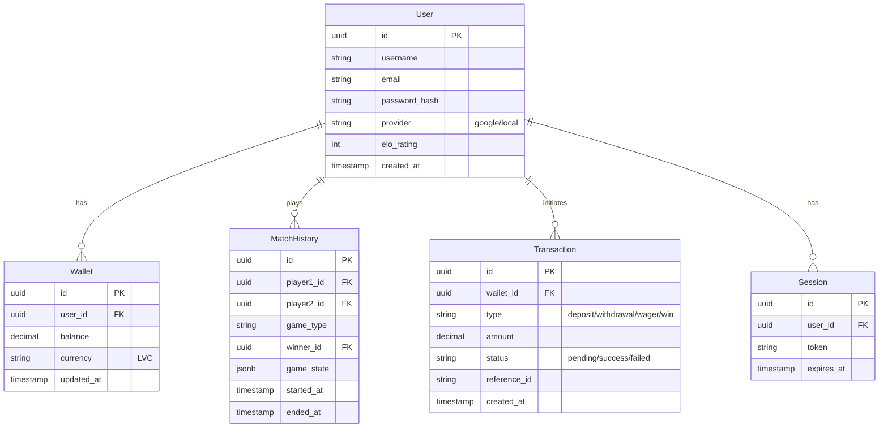

# Database Schema Design

## 1. PostgreSQL Schema (ER Diagram)

## 2. Redis Key Structure

Redis is used for real-time state, matchmaking queues, and caching.

### Matchmaking
- `queue:{game_type}`: List of user IDs waiting for a match.
  - Example: `queue:tic-tac-toe` -> `["user1", "user2"]`

### Game State
- `game:{room_id}:state`: Hash storing the current game board/status.
  - Example: `game:123:state` -> `{ "board": ".........", "turn": "user1" }`
- `game:{room_id}:players`: Set of player IDs in the room.

### Pub/Sub Channels
- `channel:game:{room_id}`: Messages for a specific game room.
- `channel:user:{user_id}`: Private notifications for a user.
- `channel:global`: System-wide announcements.

### Caching
- `cache:user:{user_id}`: Cached user profile data.
- `cache:leaderboard:{game_type}`: Sorted set for leaderboard rankings.
